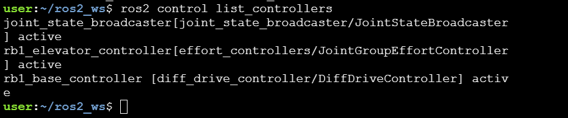
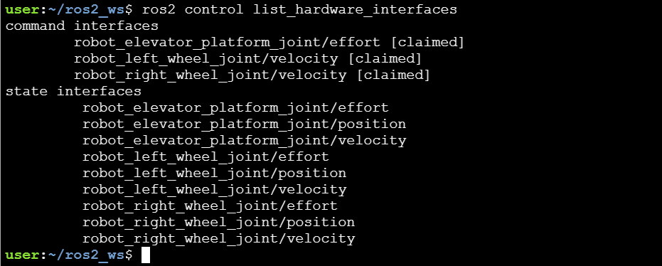

# 🤖 RB1_Control Package 🚀

Welcome to RB1_Control, a comprehensive simulation package designed to offer an immersive experience in robot operations. This package allows users to simulate the control of a robot, including the movement of its lifting unit. Whether you are a student, educator, or robotics enthusiast, MyRobotSim provides a valuable tool for understanding and experimenting with robotic mechanisms.

## 📦 Installation Instructions

Before cloning this repo, ensure you have the following prerequisites installed on your system:

- Python 3.8 or later 🐍
- ROS2 Galactic 🌌  
    `ros2 --version `
- Gazebo multi-robot simulator version 11.12+  
    `gazebo --version` 

### Step 1: 📁 Clone Repo
```bash
cd ~/ros2_ws/src
git clone <repository-url>
```

### Step 2: 🛠️ Build the Package
```bash
cd ~/ros2_ws && colcon build --packages-select rb1_ros2_description && source install/setup.bash
```
<details>
<summary><strong style="color: green;">Expected Output</strong></summary>


</details>

### Step 3: 🕹️ Launch Simulation 
```bash
ros2 launch rb1_ros2_description rb1_ros2_xacro.launch.py
```
<details>
<summary><strong style="color: green;">Expected Output</strong></summary>

<video width="640" height="480" controls>
  <source src="launch_expected_output.mp4" type="video/mp4">
  Your browser does not support the video tag.
</video>
</details>

### **🎉 Congratulations!🎉 You've Successfully Launched the Simulation!** 

## 🔴 Verification
### Check Controllers are Available
```bash
ros2 control list_controllers
```


### Check Interfaces are Available
```bash
ros2 control list_hardware_interfaces
```



## 🚗 Drive RB1
-  **Rotate** 🔄
```bash
ros2 topic pub --rate 10 /rb1_base_controller/cmd_vel_unstamped geometry_msgs/msg/Twist "{linear: {x: 0.0, y: 0,z: 0.0}, angular: {x: 0.0,y: 0.0, z: 0.5}}"
```
-  **Revolute** 🔁
```bash
ros2 topic pub --rate 10 /rb1_base_controller/cmd_vel_unstamped geometry_msgs/msg/Twist "{linear: {x: 0.5, y: 0,z: 0.0}, angular: {x: 0.0,y: 0.0, z: 0.5}}"
```
-  **STOP** ⛔
```bash
ros2 topic pub --rate 10 /rb1_base_controller/cmd_vel_unstamped geometry_msgs/msg/Twist "{linear: {x: 0.5, y: 0,z: 0.0}, angular: {x: 0.0,y: 0.0, z: 0.5}}"
```


## 🏗️ Control Elevator
-  **Lifting UP** ⬆️
```bash
ros2 topic pub /rb1_elevator_controller/commands std_msgs/msg/Float64MultiArray "data: [10.0]" -1
```
-  **Lifting DOWN** ⬇️
```bash
ros2 topic pub /rb1_elevator_controller/commands std_msgs/msg/Float64MultiArray "data: [0.0]" -1
```
# Disclaimer:

`rb1_base_description` is a package copied and modified files from these repositories/packages:

* [RobotnikAutomation/rb1_base_commmon](https://github.com/RobotnikAutomation/rb1_base_common/tree/melodic-devel) under the BSD License
